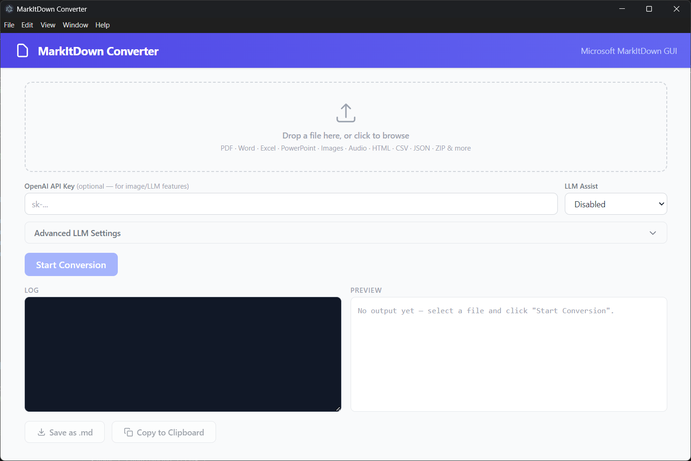

# MarkItDown Converter-GUI

[English](./README.md)

本项目是基于微软 [MarkItDown](https://github.com/microsoft/markitdown) 开发的桌面图形化前端工具。支持拖拽/选择文件，一键将 PDF、Word、Excel、PowerPoint、图片、音视频等格式转换为 Markdown。

### 快速使用

#### 预编译版（推荐）
从 [Releases](../../releases) 下载 `MarkItDown Converter 1.0.0.exe`，双击运行，开箱即用，无需任何环境配置。
注：依照markitdown，图片识别功能需要使用支持视觉识别的LLM。默认未配置，可自行配置 OpenAI API Key + Base URL + 模型名（默认折叠，展开后可自定义）。

#### 开发模式
```bash
# Windows
setup.bat

# macOS / Linux
chmod +x setup.sh && ./setup.sh

# 启动
npm start
```

### 功能
- **文件输入**：拖拽上传或点击选择，支持 PDF / DOCX / XLSX / PPTX / 图片 / 音频 / HTML / CSV / JSON / ZIP 等
- **LLM 增强**：可选 OpenAI API Key + Base URL + 模型名（默认折叠，展开后可自定义）
- **转换预览**：实时日志输出 + Markdown 语法高亮预览
- **导出**：保存为 `.md` 文件或复制到剪贴板



### 打包
```bash
# 单文件便携版（开箱即用）
npm run build:win

# @electron/packager 打包（免安装目录）
npm run pack
```

### 项目结构
```text
├── main.js           # Electron 主进程
├── preload.js        # IPC 桥接
├── index.html        # 前端 UI（Tailwind CSS）
├── renderer.js       # 前端交互逻辑
├── converter.py      # Python 转换封装
├── build-app.js      # packager 打包脚本
├── setup.bat         # Windows 初始化脚本
├── setup.sh          # macOS / Linux 初始化脚本
```

### 技术栈
- **前端**：Electron 33 + Tailwind CSS (CDN)
- **转换引擎**：Python 3.11 / markitdown[all] + PyInstaller 编译为独立 exe
